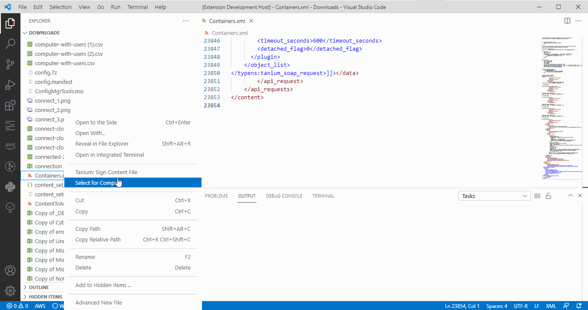
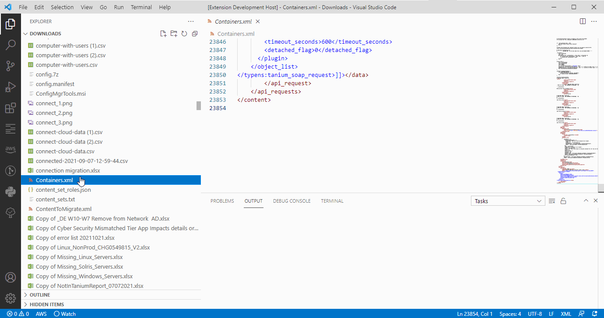
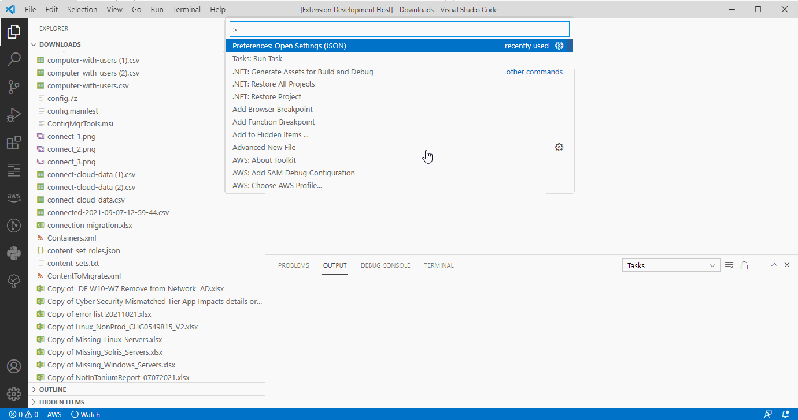

<h1>HoganSlender's Tanium Tools</h1>

Contains miscellaneous commands to work with Tanium servers in Visual Studio Code.

- [Configuration Settings](#configuration-settings)
- [Features](#features)
    - [Sign Content File](#sign-content-file)
    - [Modifying Entries](#modifying-entries)
  - [Known Issues](#known-issues)
  - [Release Notes](#release-notes)

# Configuration Settings
There are several configuration settings that control how the extension functions:

<table border=1>
  <thead>
    <tr>
      <th>Setting</th>
      <th>Description</th>
    </tr>
  </thead>
  <tbody>
    <tr>
      <td>Signing Paths</td>
      <td>Path definitions for KeyUtility.exe and private key file per Tanium Server</td>
    </tr>
  </tbody>
</table>
 

# Features

### Sign Content File

This extension allows you to sign content to be imported into Tanium.

Once you have entered the path information, all you need to do is select the target Tanium server to sign more content.

### Modifying Entries

If you need to modify the entries, just pull up the JSON settings.

## Known Issues
* none
## Release Notes
